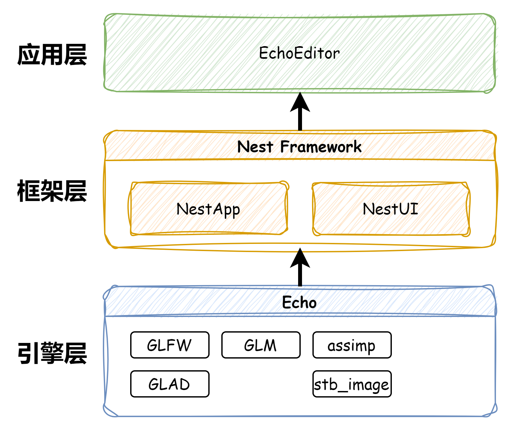

# EchoEngine

**EchoEngine**是一个用于熟悉OpenGL、了解渲染管线原理以及渲染引擎架构的学习项目。本项目是以Cherno的[Game Engine](https://www.youtube.com/playlist?list=PLlrATfBNZ98dC-V-N3m0Go4deliWHPFwT)系列视频为指导，基于自己开发的[Nest框架](https://github.com/Jerryym/Nest)，结合**GLFW、GLAD**等第三方库开发的渲染引擎项目。EchoEngine将是一个长期维护项目，最终目标是将EchoEngine开发成为一个可用于自己学习Shader的工具。

## Development Environment

* **IDE:** Visual Studio 2022
* **Qt Version:** 6.5.3

## Dependencies

EchoEngine使用到以下开源库:

* [GLFW](https://github.com/glfw/glfw) - A multi-platform library for OpenGL, OpenGL ES, Vulkan, window and input.
* [GLAD](https://github.com/Dav1dde/glad) - Multi-Language Vulkan/GL/GLES/EGL/GLX/WGL Loader-Generator based on the official specs.
* [GLM](https://github.com/g-truc/glm) - OpenGL Mathematics (GLM)
* [stb](https://github.com/nothings/stb) - stb single-file public domain libraries for C/C++
* [assimp](https://github.com/assimp/assimp) - The official Open-Asset-Importer-Library Repository. Loads 40+ 3D-file-formats into one unified and clean data structure.

## Architecture Diagram

## Reference

* [The Cherno Game Engine Series](https://www.youtube.com/playlist?list=PLlrATfBNZ98dC-V-N3m0Go4deliWHPFwT)
* [The Cherno OpenGL Serise](https://www.youtube.com/playlist?list=PLlrATfBNZ98foTJPJ_Ev03o2oq3-GGOS2)
* [LearnOpenGL](https://learnopengl-cn.github.io/)
* [Games101](https://www.bilibili.com/video/BV1X7411F744/?spm_id_from=333.1007.top_right_bar_window_history.content.click&vd_source=4e4414251af07bbefb2bd982cc7213b8)
* [Games104](https://www.bilibili.com/video/BV1oU4y1R7Km/?spm_id_from=333.788.top_right_bar_window_history.content.click&vd_source=4e4414251af07bbefb2bd982cc7213b8)
* [osgQt](https://github.com/openscenegraph/osgQt)
* 《Game Engine Architecture, Second Edition》 Jason Gregory
* 《Windows游戏编程之从零开始》 毛星云
